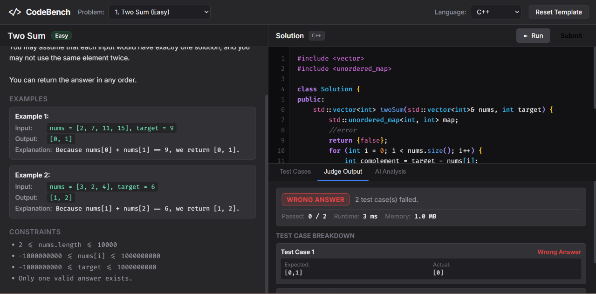
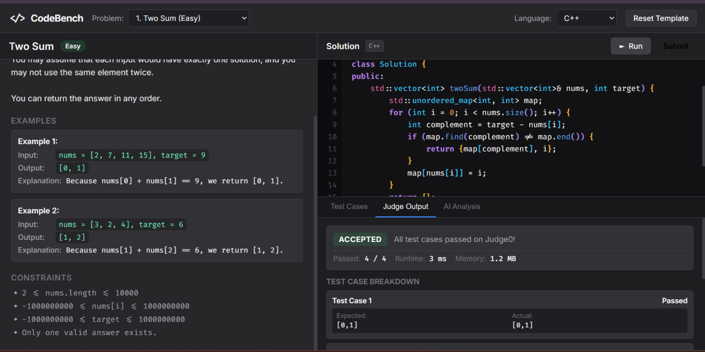
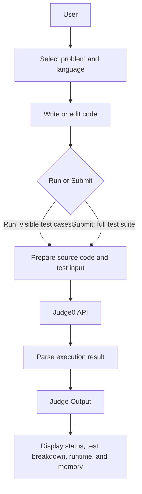

# CodeBench

CodeBench is a browser-based coding practice platform built with HTML, CSS, and vanilla JavaScript. It allows users to select programming problems, write solutions in multiple languages, execute them against test cases, and inspect detailed judge results.

## 📸 Preview

### Judge Feedback



CodeBench displays failed test cases, expected versus actual output, runtime, memory, and submission status.

### Successful Submission



Successful submissions show the number of passed test cases along with execution statistics.

**Live demo:** [Try CodeBench →](https://codebench-five.vercel.app/)

## ✨ Features

- Multi-language support for JavaScript, Python, C++, and Java.
- Custom browser-based code editor with syntax highlighting powered by a Web Worker.
- Line numbers, auto-indentation, and bracket pairing with overtype/skip behavior.
- Problem-specific starter templates.
- Run against visible test cases or submit against the full test suite.
- Add custom test cases.
- Detailed judge results, including expected versus actual output, submission status, and runtime and memory when provided by Judge0.
- Automatically save and restore drafts using browser `localStorage`, with a separate key for each problem and language.
- Extensible problem structure with separate problem definitions, test files, and language templates.
- AI-assisted code analysis is planned. The current Analyze Code button is a placeholder; no AI service is connected.

## ⚙️ How It Works



- **Run** checks the visible/sample test cases.
- **Submit** checks the complete test suite for the selected problem.

The browser prepares the source code and test input, sends them to Judge0 for execution, and processes the returned result for display in Judge Output.

## 🧠 Engineering Concepts

### 1. Asynchronous API-Based Execution

CodeBench sends source code and input to Judge0 and processes the response; it does not run the selected languages directly in the browser. This keeps language execution separate from the frontend.

### 2. Web Workers

Syntax highlighting runs in a Web Worker so highlighting work does not unnecessarily block the browser's main UI thread.

### 3. Client-Side Persistence

Drafts are stored in `localStorage` under a problem- and language-specific key, allowing users to return to their code without an application backend or database.

### 4. Modular Problem Architecture

Each problem has its own definition, test cases, and language templates. Problem data is kept separate from the editor and execution flow, making it straightforward to add problems using the existing structure.

### 5. Separation of Concerns

The application separates UI and editor behavior, problem data, test cases, execution communication, and syntax highlighting into distinct parts of the project.

## 🛠️ Tech Stack

- HTML5
- CSS3
- Vanilla JavaScript
- Web Workers
- Judge0 API (code execution)
- AI API (code analysis)
- Browser `localStorage`
- Service Worker
- Vercel (deployment target)

## 🎯 Using CodeBench

1. Select a problem.
2. Select a language and write your solution.
3. Choose **Run** or **Submit**.
4. Inspect **Judge Output** and optionally add custom test cases.

## 📊 Execution and Data

- Judge0 is the external code execution service; an internet connection is required.
- Source code and test input are sent to Judge0 when code is run or submitted.
- Drafts remain in the browser's `localStorage`.
- No application backend currently stores user code or submissions.
- AI analysis is not connected; the Analyze Code button is a placeholder.

## 📁 Project Structure

```text
.
├── index.html              # Application interface
├── styles.css              # Layout and visual styles
├── app.js                  # Editor, problem, and execution logic
├── highlighter.worker.js   # Background syntax highlighting
├── sw.js                   # Static asset caching
├── problems/
│   ├── two-sum/
│   ├── binary-search/
│   └── maximum-element/
└── README.md
```

Each problem directory contains a `problem.json` definition, `tests.json`, and language-specific starter templates.
The tree shows the three problems currently included; more problems are planned and can follow the same structure.


## 🗺️ Future Improvements

The following ideas are planned and are not currently implemented:

- AI-assisted code explanation and complexity analysis.
- More programming problems.
- Submission history.
- User progress tracking.
- Code diffs between submissions.
- More advanced editor features.
